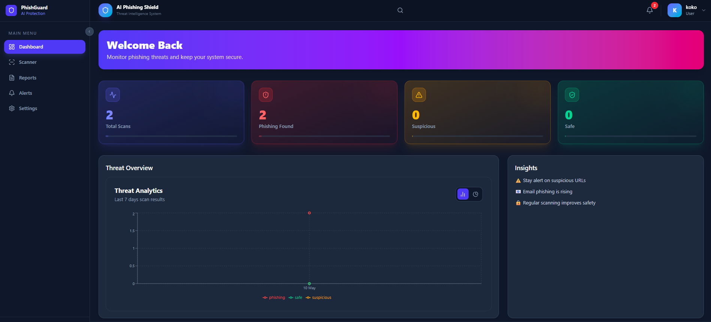
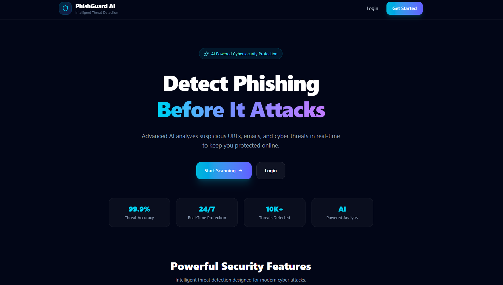
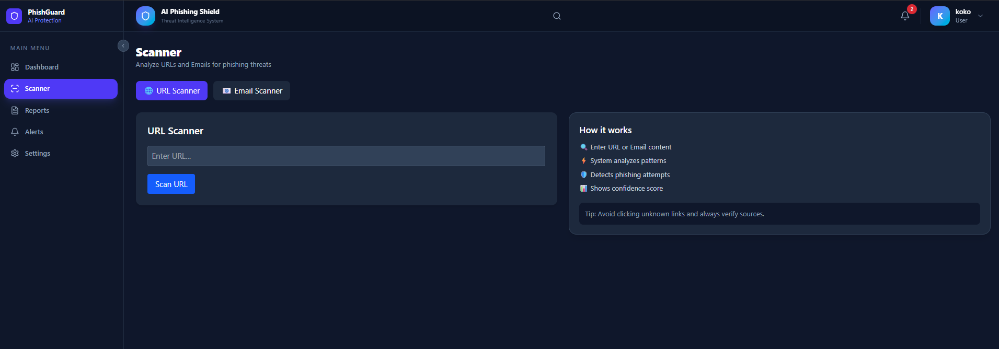
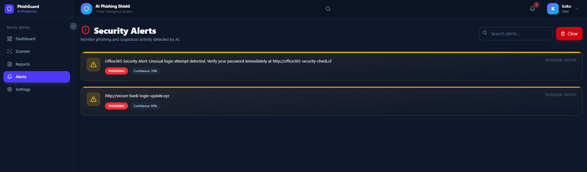

<div align="center">


# PhishGuard AI — Intelligent Phishing Detection System

**Real-time AI-powered threat detection for URLs and emails, built with the MERN stack + Google Gemini.**

[](https://react.dev)
[](https://vitejs.dev)
[](https://tailwindcss.com)
[](https://nodejs.org)
[](https://mongodb.com)
[](https://deepmind.google/technologies/gemini/)
[](LICENSE)

<br/>

[  Live Demo](https://phishing-detector-sepia.vercel.app) · [ Report Bug](https://github.com/ali4441/ali4441-phishingdetector/issues) · [ Request Feature](https://github.com/ali4441/ali4441-phishingdetector/issues)

<br/>



</div>

---

##  Table of Contents

- [Overview](#overview)
- [Key Features](#key-features)
- [Tech Stack](#tech-stack)
- [System Architecture](#system-architecture)
- [Project Structure](#project-structure)
- [Getting Started](#getting-started)
  - [Prerequisites](#prerequisites)
  - [Installation](#installation)
  - [Environment Variables](#environment-variables)
  - [Running the App](#running-the-app)
- [API Reference](#api-reference)
- [How the AI Engine Works](#-how-the-ai-engine-works)
- [Screenshots](#screenshots)
- [Deployment](#deployment)
- [Roadmap](#roadmap)
- [Contributing](#contributing)
- [License](#license)
- [Author](#author)

---

## 🛡️ Overview

**PhishGuard AI** is a full-stack cybersecurity application that uses a dual-engine approach — combining Google Gemini's large language model with a custom heuristic scoring engine — to detect phishing URLs and email content in real time.

Users get a beautiful dark-themed dashboard showing threat analytics, scan history, security alerts, and confidence scores — all updated live as new scans come in.

> Built as a production-grade portfolio project demonstrating AI integration, secure REST APIs, JWT authentication, and modern React architecture.

---

##  Key Features

| Feature | Description |
|---|---|
|  **AI-Powered Detection** | Google Gemini 1.5 Flash analyzes URLs and email text for phishing patterns |
|  **Heuristic Engine** | Fallback rule-based scoring using TLD analysis, IP detection, keyword matching |
|  **Analytics Dashboard** | Live stats cards, area/pie threat charts, paginated scan history |
|  **Real-Time Alerts** | Auto-generated alerts for phishing detections with severity levels |
|  **JWT Authentication** | Secure register/login with bcrypt-hashed passwords and protected routes |
|  **Email Scanner** | Paste raw email content for instant AI analysis with AI reasoning display |
|  **URL Scanner** | Submit any URL for threat classification with confidence scores |
|  **Reports Page** | Filterable and searchable full scan history per user |
|  **Rate Limiting** | Express rate limiter prevents API abuse (100 req / 15 min) |
|  **Structured Logging** | Morgan + custom logger writing to `access.log` and `error.log` |

---

##  Tech Stack

### Frontend (`/client`)

| Technology | Version | Purpose |
|---|---|---|
| React | 19 | UI library |
| Vite | 8 | Build tool & dev server |
| Tailwind CSS | 4 | Utility-first styling |
| React Router DOM | 7 | Client-side routing |
| Recharts | 3 | Area & pie chart visualizations |
| Axios | 1.x | HTTP client with JWT interceptor |
| Framer Motion | 12 | Animations |
| Lucide React | 1.x | Icon system |
| React Hot Toast | 2.x | Toast notifications |

### Backend (`/server`)

| Technology | Version | Purpose |
|---|---|---|
| Node.js + Express | 5 | REST API server |
| MongoDB + Mongoose | 9 | Database & ODM |
| Google GenAI SDK | 1.x | Gemini 1.5 Flash AI analysis |
| JSON Web Token | 9 | Auth token generation & verification |
| bcryptjs | 3 | Password hashing |
| Helmet | 8 | HTTP security headers |
| Morgan | 1.x | HTTP request logging |
| Express Rate Limit | 8 | Request throttling |

---

##  System Architecture

```
┌─────────────────────────────────────────────────────────────┐
│                    CLIENT (React + Vite)                    │
│                                                             │
│   LandingPage → LoginPage / RegisterPage                    │
│          ↓                                                  │
│   ProtectedRoute (JWT guard + layout shell)                 │
│          ↓                                                  │
│   Dashboard | Scanner | Reports | Alerts | Settings         │
│          ↓                                                  │
│   Axios Instance  ── Bearer token interceptor               │
└──────────────────────┬──────────────────────────────────────┘
                       │  HTTPS REST
┌──────────────────────▼──────────────────────────────────────┐
│                   SERVER (Express 5)                        │
│                                                             │
│   Helmet → CORS → RateLimiter → Morgan Logger               │
│          ↓                                                  │
│   /api/auth     authController   (register, login, me)      │
│   /api/scan     scanController   (scan, history, stats)     │
│   /api/reports  reportController (list, get, delete)        │
│   /api/alerts   alertController  (list, read, delete)       │
│          ↓                                                  │
│   mlService  →  Heuristic Engine + Google Gemini 1.5 Flash  │
│          ↓                                                  │
│   Mongoose ODM  →  MongoDB Atlas                            │
└─────────────────────────────────────────────────────────────┘
```

---

##  Project Structure

```
ali4441-phishingdetector/
│
├── client/                          # React + Vite frontend
│   ├── public/
│   ├── src/
│   │   ├── api/
│   │   │   └── axiosInstance.js     # Axios + JWT interceptor
│   │   ├── components/
│   │   │   ├── common/              # Navbar, Sidebar, Footer, Loader, AlertBadge
│   │   │   ├── dashboard/           # StatsCard, ThreatChart, RecentScans
│   │   │   ├── reports/             # ReportTable
│   │   │   └── scanner/             # UrlScanner, EmailScanner
│   │   ├── context/
│   │   │   └── AuthContext.jsx      # Global auth state (login / logout)
│   │   ├── hooks/
│   │   │   ├── useAuth.jsx          # Auth context hook
│   │   │   └── useScan.jsx          # Scan API hook
│   │   ├── pages/                   # Route-level page components
│   │   │   ├── LandingPage.jsx
│   │   │   ├── LoginPage.jsx
│   │   │   ├── RegisterPage.jsx
│   │   │   ├── DashboardPage.jsx
│   │   │   ├── ScannerPage.jsx
│   │   │   ├── ReportsPage.jsx
│   │   │   ├── AlertsPage.jsx
│   │   │   └── SettingsPage.jsx
│   │   ├── routes/
│   │   │   └── ProtectedRoute.jsx   # Auth guard + app layout shell
│   │   └── App.jsx
│   ├── vite.config.js
│   └── vercel.json                  # SPA rewrite rules for Vercel
│
└── server/                          # Node.js + Express backend
    ├── config/
    │   └── db.js                    # MongoDB connection
    ├── controllers/                 # Business logic per resource
    │   ├── authController.js
    │   ├── scanController.js
    │   ├── reportController.js
    │   └── alertController.js
    ├── middleware/
    │   ├── authMiddleware.js        # JWT verify + req.user injection
    │   ├── errorHandler.js          # Global error formatter
    │   ├── logger.js                # Morgan dev + file loggers
    │   └── rateLimiter.js           # 100 req / 15 min window
    ├── models/                      # Mongoose schemas
    │   ├── User.js
    │   ├── ScanResult.js
    │   ├── Alert.js
    │   └── Report.js
    ├── routes/                      # Express route definitions
    ├── services/
    │   └── mlService.js             # Heuristic + Gemini AI engine
    ├── utils/
    │   └── logger.js                # Custom structured logger
    └── server.js                    # App entry point
```

---

##  Getting Started

### Prerequisites

```
Node.js  >= 18.0.0
npm      >= 9.0.0
A MongoDB Atlas cluster (or local MongoDB)
A Google Gemini API key
```

### Installation

**1. Clone the repository**
```bash
git clone https://github.com/Ali4441/phishingDetector.git
cd ali4441-phishingdetector
```

**2. Install server dependencies**
```bash
cd server
npm install
```

**3. Install client dependencies**
```bash
cd ../client
npm install
```

### Environment Variables

**`server/.env`**
```env
PORT=5000
MONGO_URI=mongodb+srv://<user>:<password>@cluster.mongodb.net/phishguard
JWT_SECRET=your_super_secret_jwt_key_here
GEMINI_API_KEY=your_google_gemini_api_key_here
CLIENT_URL=http://localhost:5173
NODE_ENV=development
```

**`client/.env`**
```env
VITE_SERVER_URL=http://localhost:5000
```

>  Get your free Gemini API key at [Google AI Studio](https://aistudio.google.com/app/apikey)

### Running the App

**Terminal 1 — Start the backend**
```bash
cd server
npm run dev        # nodemon, auto-restarts on change
```

**Terminal 2 — Start the frontend**
```bash
cd client
npm run dev        # Vite dev server with HMR
```

**Open in browser**
```
Frontend  →  http://localhost:5173
Backend   →  http://localhost:5000
Health    →  http://localhost:5000/api/health
```

---

##  API Reference

All protected routes require the header:
```
Authorization: Bearer <your_jwt_token>
```

###  Auth — `/api/auth`

| Method | Endpoint | Auth | Description |
|--------|----------|:----:|-------------|
| `POST` | `/register` | yes | Create a new user account |
| `POST` | `/login` | yes | Login and receive a JWT token |
| `GET` | `/me` | yes | Get the authenticated user's profile |

**Register / Login Response**
```json
{
  "success": true,
  "token": "eyJhbGciOiJIUzI1NiIs...",
  "user": {
    "id": "664abc123...",
    "name": "Ali Hassan",
    "email": "ali@example.com",
    "role": "user"
  }
}
```

---

###  Scan — `/api/scan`

| Method | Endpoint | Auth | Description |
|--------|----------|:----:|-------------|
| `POST` | `/` | yes | Submit a URL or email for AI scanning |
| `GET` | `/history` | yes | Fetch the user's last 50 scan results |
| `GET` | `/stats` | yes | Get total / phishing / suspicious / safe counts |

**POST `/api/scan` — Request Body**
```json
{
  "type": "url",
  "input": "http://secure-login-verify.xyz/account"
}
```

**Scan Response**
```json
{
  "success": true,
  "scan": {
    "_id": "664xyz...",
    "type": "url",
    "input": "http://secure-login-verify.xyz/account",
    "result": "phishing",
    "confidence": 94,
    "details": {
      "heuristicScore": 55,
      "aiReason": "URL contains phishing keywords and a suspicious TLD (.xyz)",
      "aiPowered": true,
      "type": "url"
    },
    "createdAt": "2025-05-10T08:30:00.000Z"
  }
}
```

---

###  Alerts — `/api/alerts`

| Method | Endpoint | Auth | Description |
|--------|----------|:----:|-------------|
| `GET` | `/` | yes | Get all alerts + unread count |
| `PUT` | `/:id/read` | yes | Mark a single alert as read |
| `PUT` | `/read-all` | yes | Mark all alerts as read |
| `DELETE` | `/:id` | yes | Delete a specific alert |

---

###  Reports — `/api/reports`

| Method | Endpoint | Auth | Description |
|--------|----------|:----:|-------------|
| `GET` | `/` | yes | List reports (supports `type`, `result`, `page`, `limit`) |
| `GET` | `/:id` | yes | Get a single report by ID |
| `DELETE` | `/:id` | yes | Delete a report |

---

##  How the AI Engine Works

PhishGuard uses a **two-layer analysis pipeline** inside `server/services/mlService.js` to ensure both accuracy and resilience:

```
User Input (URL or Email Text)
             │
             ▼
┌────────────────────────────┐
│  Layer 1: Heuristic Engine │
│                            │
│  Phishing keywords  +15 pts│
│  Suspicious TLDs    +25 pts│  (.xyz .tk .ml .ga .cf)
│  IP-based URL       +30 pts│
│  Excessive hyphens  +10 pts│
│                            │
│  → heuristicScore (0–100)  │
└────────────┬───────────────┘
             │
             ▼
┌────────────────────────────┐
│  Layer 2: Google Gemini    │
│          1.5 Flash         │
│                            │
│  Classifies input as:      │
│  safe / suspicious /       │
│  phishing                  │
│                            │
│  Returns: result +         │
│  confidence + reason       │
└────────────┬───────────────┘
             │
             ▼
  finalConfidence = min(99,
    aiConfidence + heuristicScore / 5)

    If Gemini fails → heuristic-only
     fallback ensures 100% uptime
```

When a **phishing** result is detected, the system automatically creates an `Alert` document with `high` or `critical` severity depending on confidence level (threshold: 85%).

---

##  Screenshots

| Landing Page | Dashboard |
|---|---|
|  |  |

| Scanner | Alerts |
|---|---|
|  |  |

> Replace placeholder images above with real screenshots from your running app.

---

##  Deployment

### Frontend → Vercel

The `client/vercel.json` already configures SPA rewrites. Just run:

```bash
npm i -g vercel
cd client
vercel --prod
```

Set this environment variable in the Vercel dashboard:
```
VITE_SERVER_URL = https://your-backend-url.com
```

### Backend → Render / Railway / Fly.io

Set the following environment variables on your platform:

```
PORT           = 5000
MONGO_URI      = mongodb+srv://...
JWT_SECRET     = <strong-random-secret>
GEMINI_API_KEY = <your-key>
CLIENT_URL     = https://your-frontend.vercel.app
NODE_ENV       = production
```

Start command:
```bash
node server.js
```

---

##  Roadmap

- [x] URL & Email scanning with Gemini AI
- [x] JWT authentication & protected routes
- [x] Dashboard with live stats & threat charts
- [x] Real-time alerts with severity classification
- [x] Rate limiting & structured file logging
- [ ] Bulk URL scanning via CSV upload
- [ ] PDF report export
- [ ] Admin panel with user management
- [ ] Browser extension for inline scanning
- [ ] Webhook notifications (Slack / Discord)
- [ ] Two-factor authentication (2FA)

---

##  Contributing

Contributions, issues, and feature requests are welcome!

```bash
# 1. Fork the project on GitHub

# 2. Create your feature branch
git checkout -b feature/your-feature-name

# 3. Commit your changes (use Conventional Commits)
git commit -m "feat: add bulk CSV scanning"

# 4. Push to your branch
git push origin feature/your-feature-name

# 5. Open a Pull Request on GitHub
```

Please follow [Conventional Commits](https://www.conventionalcommits.org/) for commit message style and ensure your code passes ESLint before submitting.

---

##  License

Distributed under the **MIT License**. See [`LICENSE`](LICENSE) for details.

---

##  Author

<div align="center">

**Eed Mohammad**

[](https://github.com/ali4441)
[](https://linkedin.com)

*If this project helped you, please consider giving it a  — it means a lot!*

</div>

---

<div align="center">

**Built with ❤️ using React, Node.js, MongoDB & Google Gemini AI**

</div>
